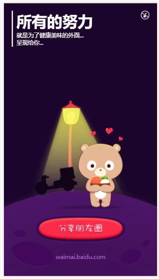
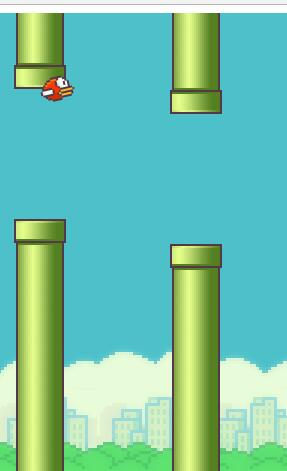

# PersonalDemo
## 分享自己仿做的一些小项目

1.  仿乐乎app界面


```js
 利用了一些css3属性和弹性布局搭建的整个页面布局，
 内部嵌套了多层swiper插件提供的结构，
 滑动逻辑主要用swiper插件实现
```


2. 仿百度外卖宣传页



```js
逻辑实现主要用到的插件有 zepto.js  css布局用的sass工具，
整个页面用了大量CSS3的动画去实现，整个案例的难点在踢三块牌子那里，
踢完之后要恢复成原来的样子，具体实现请看源代码；

```
  


3. 仿嘀嘀打车app


```js
前面的宣传页也是用了大量的css3动画实现的，
ajax请求那里，调用的是百度的地图接口，
百度的接口一般要用jsonp跨域请求，
信息验证是调用的图灵机器人里的一个接口

```


4. 飞行的小鸟（pc端）



```js
用面向对象的思想把天空，小鸟，陆地，管道分成了一个个模块，各个模块之间进行很好的隔离，
实现了高复用，低耦合，整个案例最难的地方在小鸟下落的地方，
因为小鸟的下落不是匀速的，并且脑袋的旋转速度要跟下落的速度成正比，
这里面需要用到物理知识，具体实现过程请看源代码；
```
